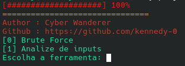

# LoginTestLab:
## O projeto começou como um experimento em Python utilizando Selenium, com o objetivo de estudar automação de páginas web e interação com formulários de login em um ambiente autorizado.

### Na primeira versão (v0.1.0), foi desenvolvido um script simples capaz de:

.Inicializar o navegador Chrome automaticamente;                                                                                 
.Acessar uma página de login;                                                                                                                        
.Localizar os campos de usuário e senha;                                                                                                                                                                  
.Preencher os campos automaticamente;                                                                                                                                                                  
.Gerar combinações numéricas para testes;                                                                                                                                                                  
.Enviar o formulário;                                                                                                                                                                  
.Verificar o resultado da autenticação através da URL;                                                                                                                                                                  
.Encerrar o navegador ao finalizar a execução.                                                                                              
**Desenvolvimento do projeto**

Durante o desenvolvimento, uma das etapas fundamentais é analisar a estrutura HTML da página que será utilizada no teste. É necessário identificar corretamente os elementos do formulário, como os campos de usuário, senha e o botão de envio.

# Versão 2.0

Nessa versão o projeto ja conta com um menu de seleção pra poder escolher que possa escolher a funço que vai ser executada,
podendo escolher entre fazer a analize do site para ver seus inputs e também o ataque de força bruta no site.

    

**Status: versão inicial — em desenvolvimento.**

